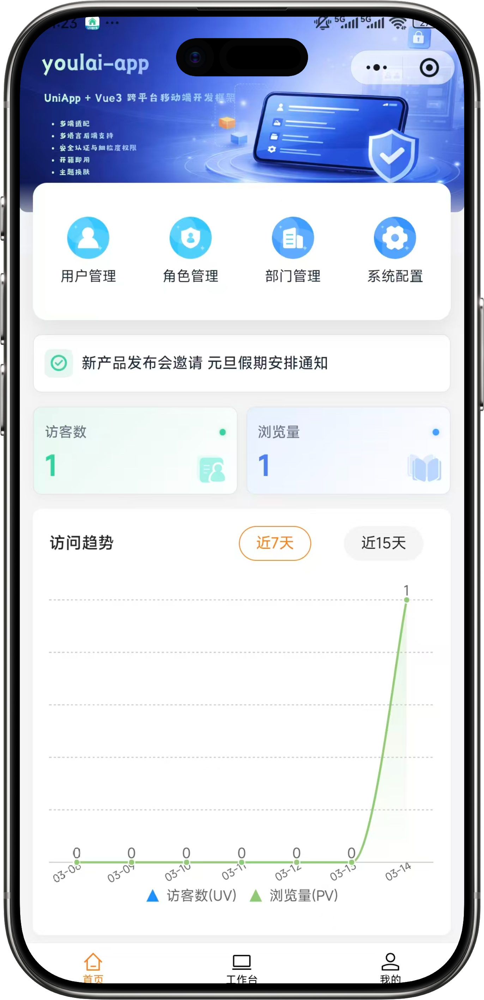
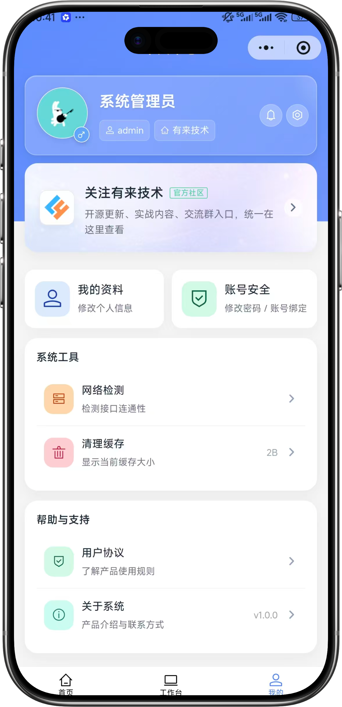

<div align="center">

# youlai-app

**基于 uni-app、Vue 3、TypeScript 和 Wot UI 的移动端跨平台应用模板**

[](https://vuejs.org/)
[](https://uniapp.dcloud.net.cn/)
[](https://www.typescriptlang.org/)
[](https://wot-ui.cn/)
[](LICENSE)

[在线预览](https://app.youlai.tech) | [项目文档](https://www.youlai.tech/docs/app/) | [配套后端](https://www.youlai.tech/docs/server/) | [PC 管理端](https://www.youlai.tech/docs/web/)

</div>

## 项目介绍

**youlai-app** 是有来开源生态的移动端项目，面向 H5、微信小程序和 App 等多端场景，适合用作企业中后台、会员中心、移动工作台、小程序业务端的二次开发基础。

项目和 [vue3-element-admin](https://gitee.com/youlaiorg/vue3-element-admin)、[youlai-boot](https://gitee.com/youlaiorg/youlai-boot) 使用同一套接口规范，可直接对接 Java / Node.js / Go / Python / PHP / C# 等多种后端实现。

## 核心特性

- **跨端开发**：一套代码支持 H5、微信小程序、App 等平台。
- **Vue 3 技术栈**：基于 Vue 3、TypeScript、Pinia、Vite 和 uni-app。
- **Wot UI 组件库**：移动端组件风格统一，适合快速搭建业务页面。
- **自动化能力**：集成页面路由、组件自动导入、API 自动导入等常用工程能力。
- **规范化工程**：内置 ESLint、Prettier、Stylelint、Husky、Commitlint。
- **生态联动**：可与 `vue3-element-admin` 和有来多语言后端无缝配套使用。

## 系统预览

<table align="center">
  <tr>
    <td></td>
    <td></td>
    <td></td>
    <td></td>
  </tr>
</table>

## 在线体验

| 类型 | 地址 |
|:-----|:-----|
| H5 预览 | [https://app.youlai.tech](https://app.youlai.tech) |
| 官方文档 | [https://www.youlai.tech/docs/app/](https://www.youlai.tech/docs/app/) |
| PC 管理端 | [https://vue.youlai.tech](https://vue.youlai.tech) |
| Apifox 接口文档 | [https://www.apifox.cn/apidoc/shared-195e783f-4d85-4235-a038-eec696de4ea5](https://www.apifox.cn/apidoc/shared-195e783f-4d85-4235-a038-eec696de4ea5) |

默认账号：`admin` / `123456`

## 快速开始

### 环境要求

- Node.js 18+
- pnpm 8+
- 微信开发者工具（运行微信小程序时需要）

### 安装依赖

```bash
pnpm install
```

### H5 启动

```bash
pnpm run dev:h5
```

启动后访问 [http://localhost:4096](http://localhost:4096)。

### H5 打包

```bash
pnpm run build:h5
```

构建产物默认输出到 `dist/build/h5`，可部署到 Nginx、OSS、静态站点托管等服务。

## 微信小程序

### 开发调试

```bash
pnpm run dev:mp-weixin
```

编译完成后，使用微信开发者工具导入 `dist/dev/mp-weixin` 目录。

### 生产打包

```bash
pnpm run build:mp-weixin
```

构建产物默认输出到 `dist/build/mp-weixin`，在微信开发者工具中导入后即可预览、上传和提交审核。

### 微信开发者工具配置

导入项目后，进入右上角 **详情** → **本地设置**，建议开发环境按以下方式配置：

- 勾选 **不校验合法域名、web-view（业务域名）、TLS 版本以及 HTTPS 证书**。
- 勾选 **ES6 转 ES5**。
- 取消勾选 **过滤无依赖文件**，避免部分组件无法加载。
- 如遇组件加载异常，可依次尝试清除缓存、重新编译、重新载入项目配置。

## 常用命令

| 命令 | 说明 |
|:-----|:-----|
| `pnpm run dev:h5` | 启动 H5 开发服务 |
| `pnpm run build:h5` | 构建 H5 生产包 |
| `pnpm run dev:mp-weixin` | 编译微信小程序开发包 |
| `pnpm run build:mp-weixin` | 构建微信小程序生产包 |
| `pnpm run dev:app` | 启动 App 开发编译 |
| `pnpm run build:app` | 构建 App 生产包 |
| `pnpm run type-check` | TypeScript 类型检查 |
| `pnpm run lint:eslint` | ESLint 检查并修复 |
| `pnpm run lint:prettier` | Prettier 格式化 |
| `pnpm run lint:stylelint` | Stylelint 检查并修复 |

## 目录结构

```text
youlai-app/
├── docs/                         # README 预览图、二维码等文档资源
├── public/                       # 静态资源
├── src/
│   ├── api/                      # 接口请求
│   ├── components/               # 通用组件和业务组件
│   ├── composables/              # 组合式函数
│   ├── config/                   # 项目配置
│   ├── constants/                # 常量定义
│   ├── enums/                    # 枚举定义
│   ├── layouts/                  # 页面布局
│   ├── pages/                    # 页面文件
│   ├── router/                   # 路由配置
│   ├── static/                   # 应用静态资源
│   ├── store/                    # Pinia 状态管理
│   ├── styles/                   # 全局样式
│   ├── types/                    # 类型声明
│   ├── utils/                    # 工具函数
│   ├── App.vue                   # 应用入口组件
│   ├── main.ts                   # 应用入口文件
│   ├── manifest.json             # uni-app 应用配置
│   └── pages.json                # 页面和导航配置
├── package.json                  # 依赖和脚本
├── pages.config.ts               # 页面生成配置
├── unocss.config.ts              # UnoCSS 配置
└── vite.config.ts                # Vite 配置
```

## 配套生态

| 项目 | 技术栈 | 说明 |
|:-----|:-------|:-----|
| [vue3-element-admin](https://gitee.com/youlaiorg/vue3-element-admin) | Vue 3 + Element Plus | PC 管理端 |
| [youlai-boot](https://gitee.com/youlaiorg/youlai-boot) | Spring Boot | Java 后端 |
| [youlai-nest](https://gitee.com/youlaiorg/youlai-nest) | NestJS + TypeORM | Node.js 后端 |
| [youlai-gin](https://gitee.com/youlaiorg/youlai-gin) | Go + Gorm | Go 后端 |
| [youlai-django](https://gitee.com/youlaiorg/youlai-django) | Django + DRF | Python 后端 |
| [youlai-think](https://gitee.com/youlaiorg/youlai-think) | ThinkPHP 8 | PHP 后端 |
| [youlai-aspnet](https://gitee.com/youlaiorg/youlai-aspnet) | ASP.NET Core | C# 后端 |

## 联系我们

如果这个项目对你有帮助，欢迎关注公众号、体验小程序，也可以添加作者微信交流技术、问题反馈、二次开发和商务合作。

<p align="center">
  
  &nbsp;&nbsp;&nbsp;&nbsp;
  
  &nbsp;&nbsp;&nbsp;&nbsp;
  
</p>
<p align="center">
  <sub>公众号「有来技术」</sub>
  &nbsp;&nbsp;&nbsp;&nbsp;&nbsp;&nbsp;&nbsp;&nbsp;
  <sub>有来技术小程序</sub>
  &nbsp;&nbsp;&nbsp;&nbsp;&nbsp;&nbsp;&nbsp;&nbsp;
  <sub>添加作者微信</sub>
</p>
<p align="center"><em>技术交流 · 问题反馈 · 二开定制 · 商务合作</em></p>

## 开源协议

本项目基于 [Apache License 2.0](LICENSE) 开源，可免费用于商业项目。
